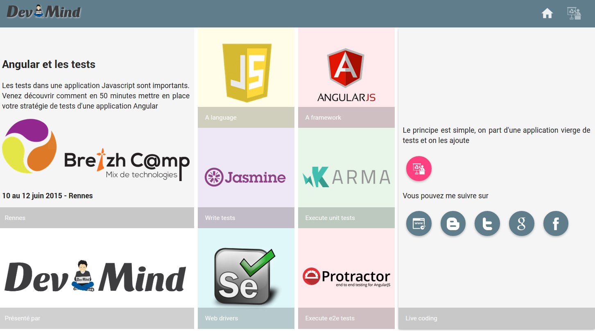

# AngularAndTests


Cette application est utilisée pour illustrer ma conférence sur les [tests dans une application Javascript](http://cfp.breizhcamp.org/2015/talk/EKC-0429/Tester_une_application_Javascript) 



Si vous voulez utiliser l'application vous pouvez d'abord récupérer l'application backend écrite en Java et utilisant Spring Boot (voir [repo github](https://github.com/javamind/AngularAndTestsBackend)) 

Ensuite vous pouvez lancer les commandes suivantes

```
 npm install
 bower update
```

Le projet utilise `gulp` donc pour lancer l'application, vous pouvez utiliser la commande

```
 gulp serve
```
